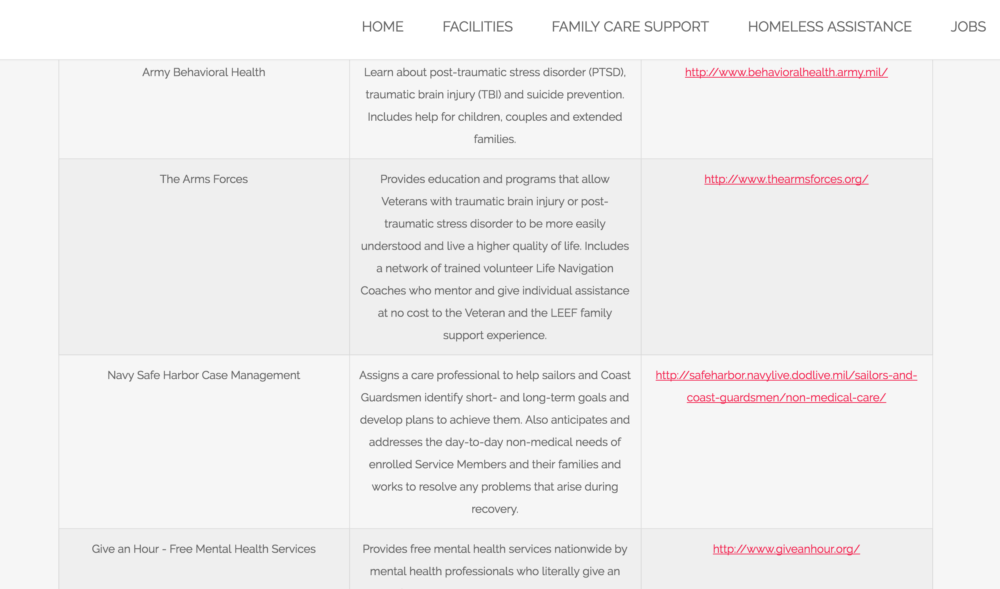

# VeteranHack

## About 
* This project was developed at YHack 2015 in order to display web resources available for veterans. 

## Getting the project
* Clone the repo and open 'veteran/index.html'

## Other work that is not finished 
* We also parsed some data Fiscal Note, and a display for showing those political bills have not been implemented. 

## Some Partial Screenshots
![Home Page Screenshot] (HomePageScreenshot.png)
